# Assignment IV — Deploy Your First Web App using GitHub & Render

**Course:** Continuous Integration and Continuous Deployment (DSO101)  
**Programme:** Bachelor's of Engineering in Software Engineering (SWE)  
**Name:** Tshering Euden  
**Student ID:** 02240368  
**GitHub Repo:** https://github.com/eudeyy85/TsheringEuden_02240368_DSO101_A4  
**Live URL:** https://tsheringeuden-02240368-dso101-a4.onrender.com/webpage.html

---

## 1. Assignment Overview

This assignment required deploying a web application using GitHub and Render, covering:

- **Git & GitHub** – creating a repository and pushing code
- **CI/CD** – setting up GitHub Actions for automated workflow
- **Deployment** – deploying a static portfolio website on Render

I chose **Option A (Static Website)** and built a personal portfolio page using HTML and CSS.

---

## 2. Project Setup

### 2.1 Portfolio Website (Local)

I created a personal portfolio website with my name, photo, title, location (Phuntsholing, Bhutan), and social links. The site was first tested locally using Live Server in VS Code at `127.0.0.1:5500`.
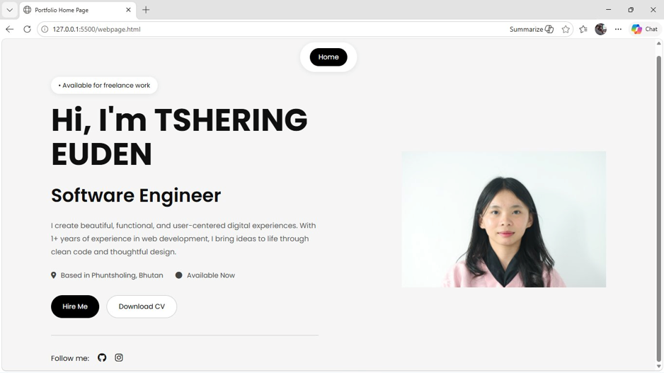

### 2.2 Project File Structure

```
TsheringEuden_02240368_DSO101_A4/
├── .github/
│   └── workflows/
│       └── deploy.yml
├── webpage.html
├── webpage.css
├── app.py
├── requirements.txt
├── TSHERING EUDEN (02240368).JPG
└── README.md
```
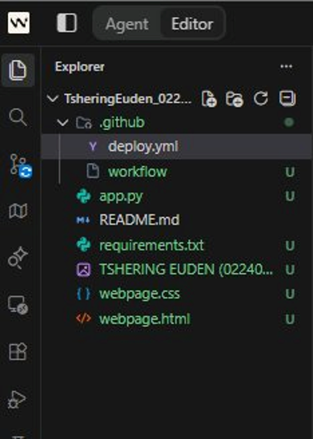
- `webpage.html` – main HTML page
- `webpage.css` – stylesheet
- `app.py` – Python file (included as optional)
- `requirements.txt` – Python dependencies
- `README.md` – project documentation
- `TSHERING EUDEN (02240368).JPG` – profile photo
- `.github/workflows/deploy.yml` – GitHub Actions workflow

---

## 3. GitHub Repository

### 3.1 Pushing Code to GitHub

I initialized the repository and pushed all project files to GitHub using the following Git commands:

```bash
git add .
git commit -m "Second Commit"
git push origin main
```
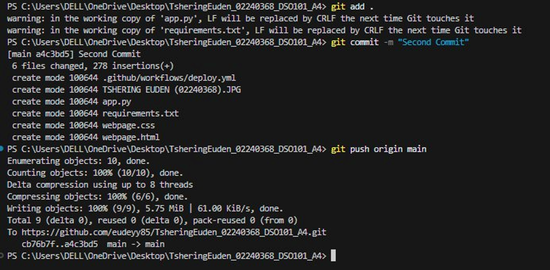

### 3.2 GitHub Repository (After Push)

After pushing, the repository `TsheringEuden_02240368_DSO101_A4` was visible on GitHub with all files uploaded under the `main` branch.
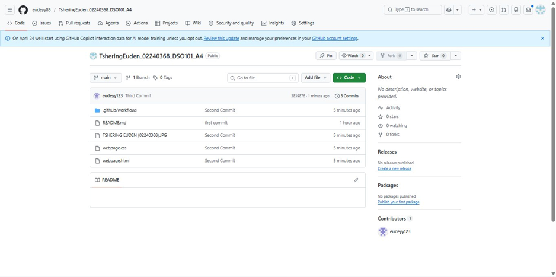
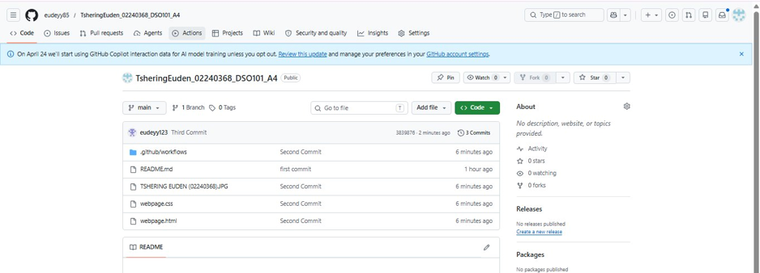
---

## 4. GitHub Actions (CI/CD Workflow)

### 4.1 deploy.yml Workflow File

I created the CI/CD workflow at `.github/workflows/deploy.yml`:

```yaml
name: Deploy to Render

on:
  push:
    branches: [ "main" ]

jobs:
  deploy:
    runs-on: ubuntu-latest

    steps:
    - name: Checkout code
      uses: actions/checkout@v3

    - name: Dummy step
      run: echo "Code pushed successfully!"
```
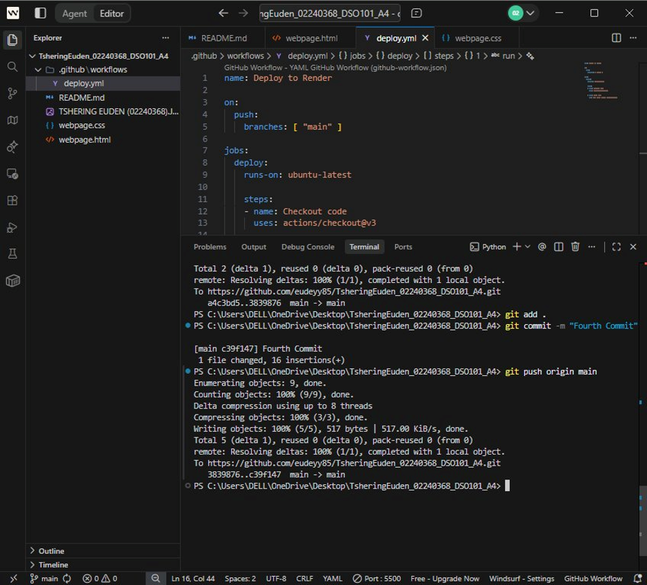

The workflow triggers on every push to the `main` branch and runs a deploy job on `ubuntu-latest`.

### 4.2 Initial Workflow Failures

The first two workflow runs (**Second Commit** and **Third Commit**) failed due to a missing `on:` event trigger in the YAML file. The error message was:
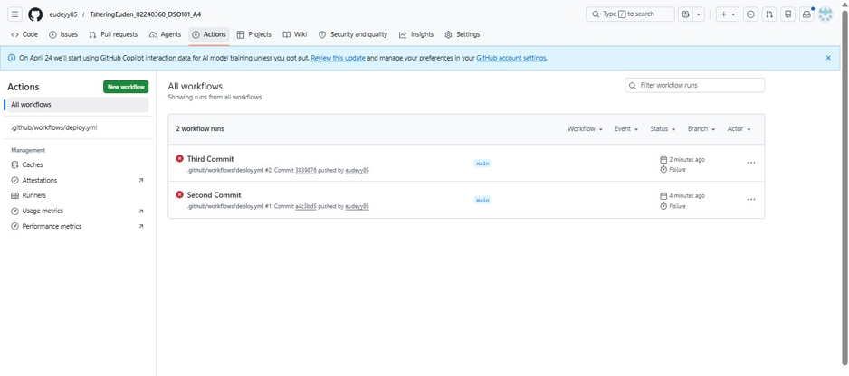
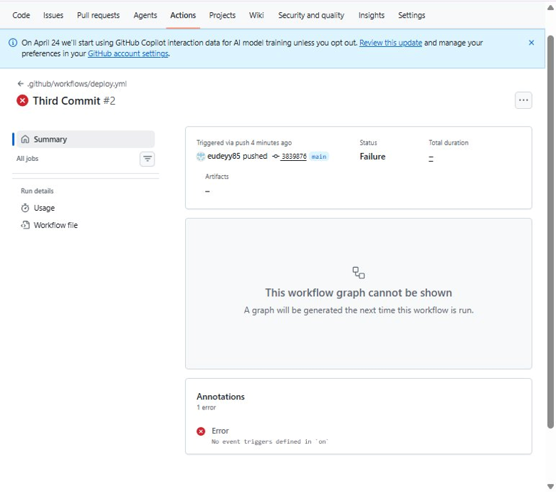
```
No event triggers defined in 'on'
```

### 4.3 Successful Workflow Run

After fixing the `deploy.yml` file to include the correct `on: push: branches: [main]` trigger, the **Fourth Commit** workflow ran successfully with a green checkmark and completed in **15 seconds**.
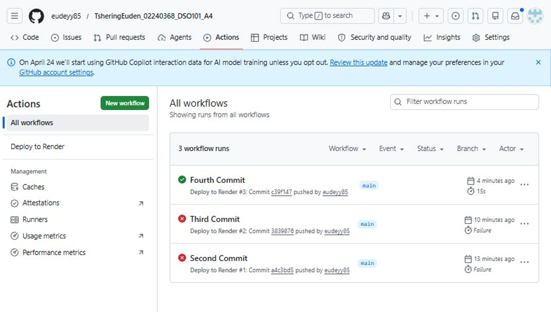
---

## 5. Deployment on Render

### 5.1 Render Dashboard

I logged into [Render.com](https://render.com) and navigated to the Projects overview.
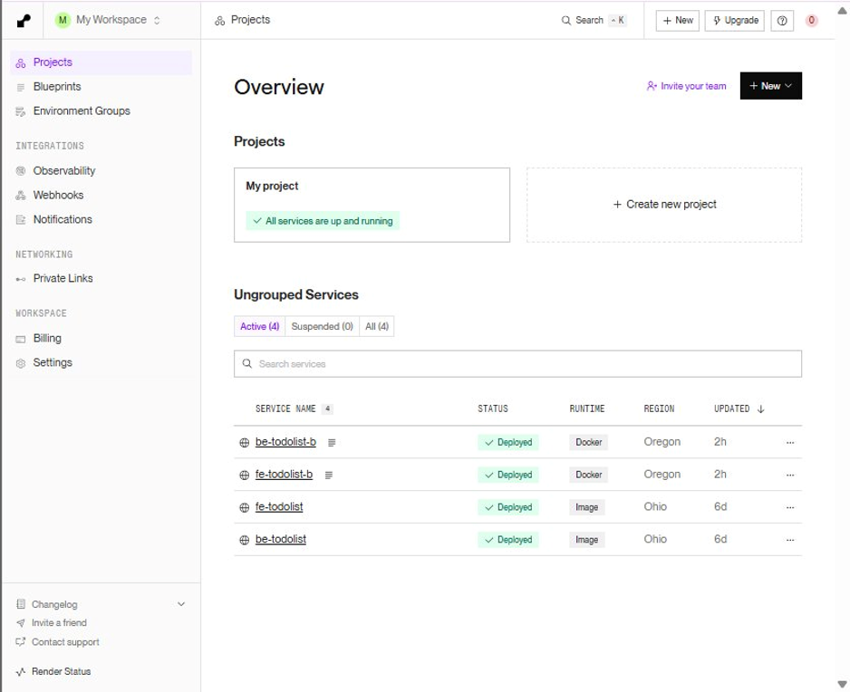

### 5.2 Creating a New Static Site

Clicked **+ New** → **Static Site** to deploy the portfolio website.
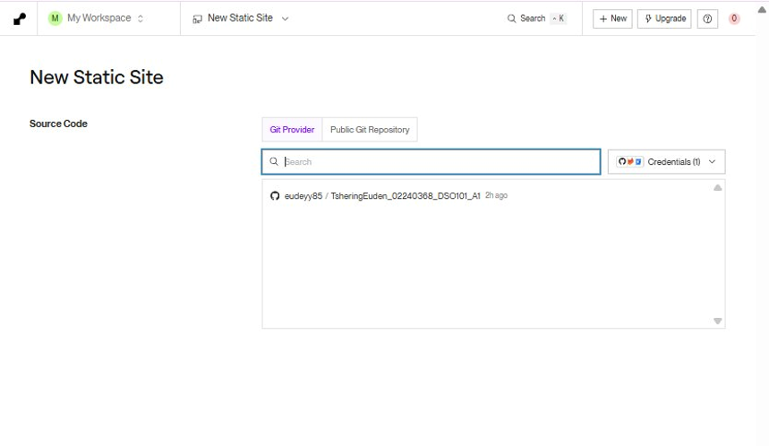

### 5.3 Connecting GitHub Repository

Connected my GitHub account and selected the repository `TsheringEuden_02240368_DSO101_A4` from the list.
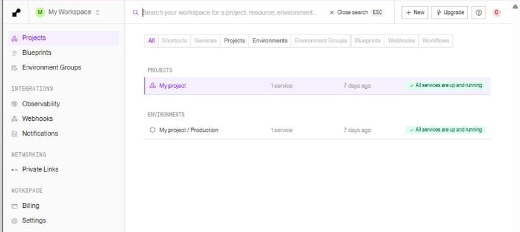
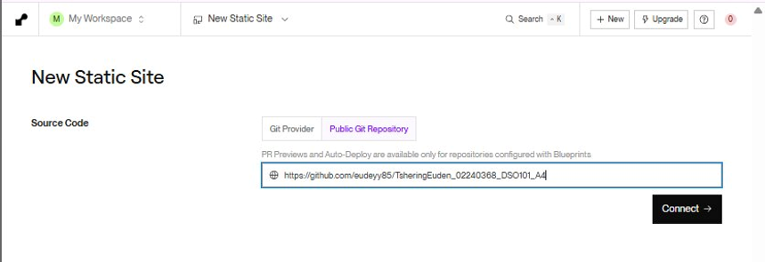

### 5.4 Static Site Configuration

| Setting | Value |
|---|---|
| Name | TsheringEuden_02240368_DSO101_A4 |
| Branch | main |
| Build Command | *(left blank)* |
| Publish Directory | *(left blank)* |
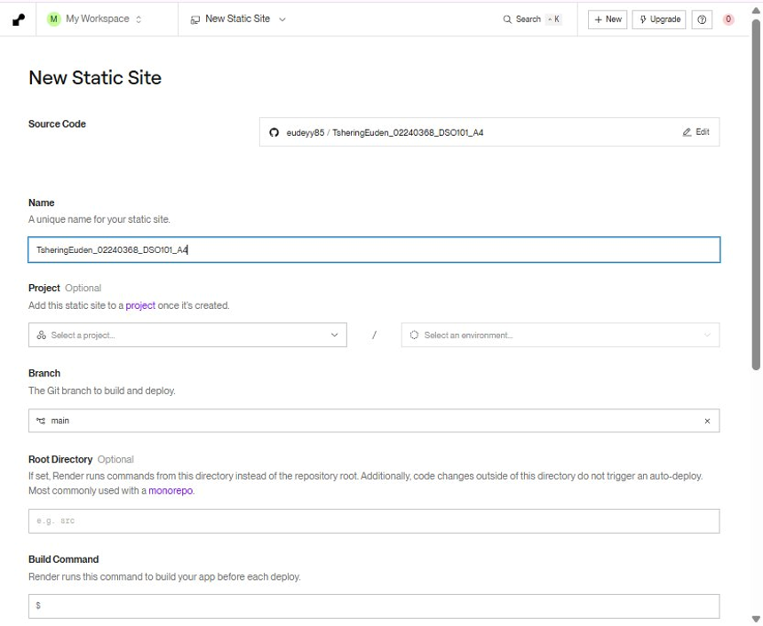
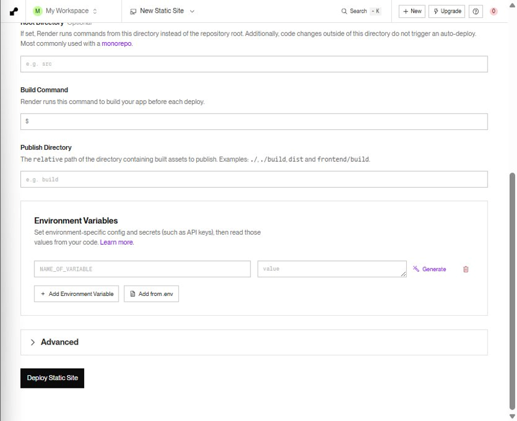
---

## 6. Live Deployment

### 6.1 Build Logs and Live Status

After clicking Deploy, Render:
1. Cloned the repository from GitHub
2. Checked out the latest commit (`c39f147` – Fourth Commit)
3. Deployed the static site
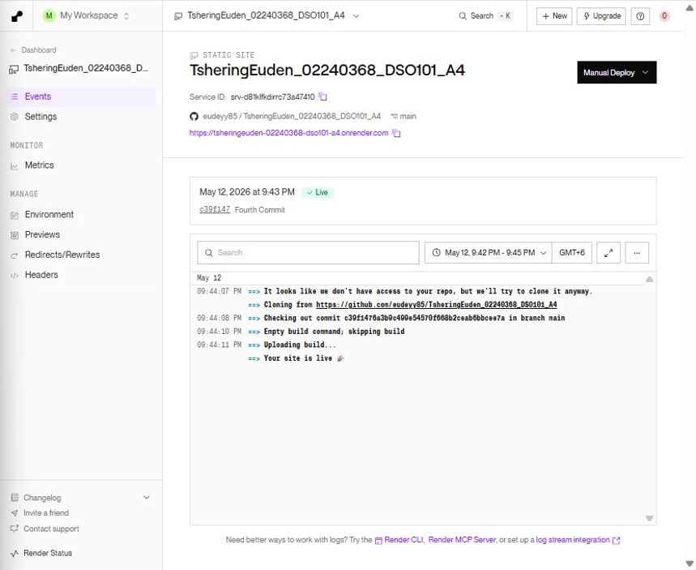
Deploy logs confirmed: **"Your site is live "**

### 6.2 Deployed Portfolio Website

The portfolio website is live at:  
👉 https://tsheringeuden-02240368-dso101-a4.onrender.com/webpage.html
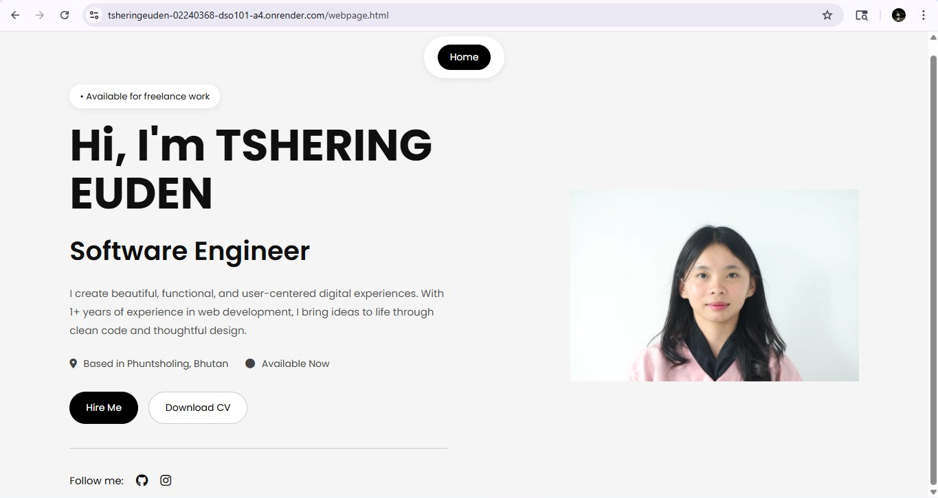
---

## 7. Fixing Root URL (Redirect/Rewrite Rule)

When visiting the root URL (`https://tsheringeuden-02240368-dso101-a4.onrender.com`), it showed **"Not Found"** because the entry point is `webpage.html`, not `index.html`.

**Fix:** Added a Rewrite rule in Render under **Redirects/Rewrites**:

| Field | Value |
|---|---|
| Source | `/` |
| Destination | `/webpage.html` |
| Action | Rewrite |
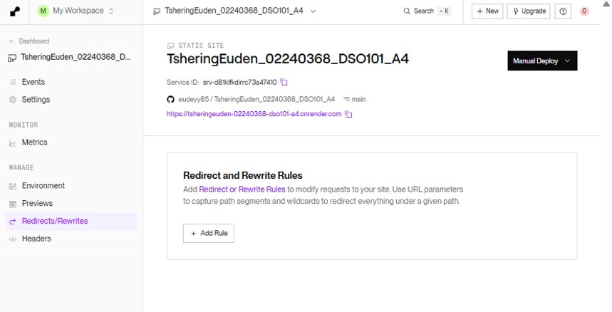
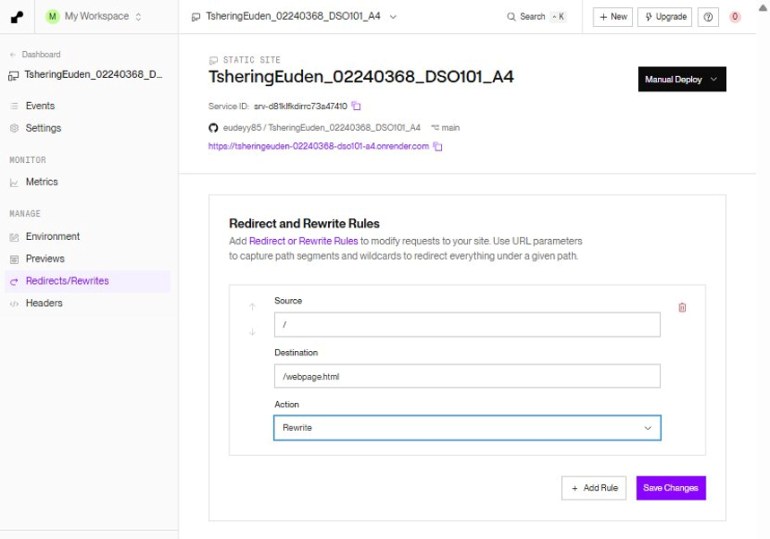
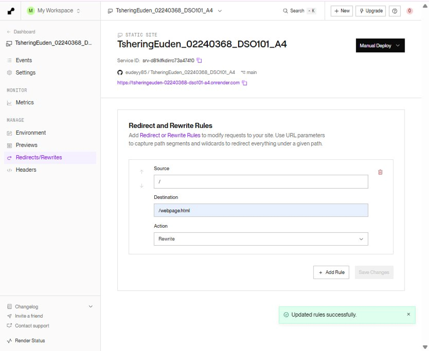
> **Note:** After saving the rule, the root URL still showed "Not Found" because Render requires a new deploy to apply rewrite rules. The correct URL with `/webpage.html` works successfully.

---

## 9. Conclusion

This assignment successfully demonstrated the complete CI/CD pipeline from code creation to live deployment:

- A personal portfolio website was built using HTML and CSS
- The code was version-controlled using Git and pushed to GitHub
- A GitHub Actions workflow (`deploy.yml`) was created to automate CI/CD on push to `main`
- The site was deployed as a Static Site on Render and made live
- Rewrite rules were configured to handle URL routing

**Repository:** https://github.com/eudeyy85/TsheringEuden_02240368_DSO101_A4  
**Live URL:** https://tsheringeuden-02240368-dso101-a4.onrender.com/webpage.html
